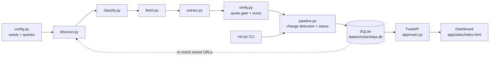
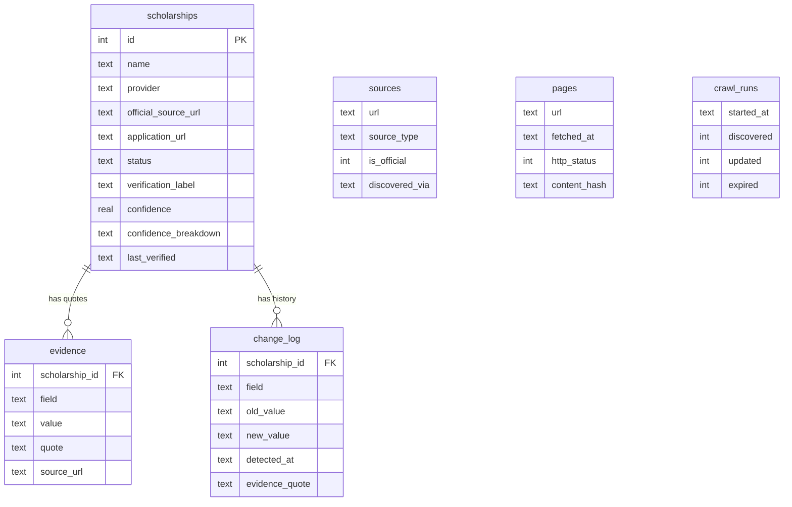

# Scholarship Intelligence Crawler

An automated, evidence-first crawler that discovers scholarships for Indian students, extracts them into a structured schema, verifies them against official sources, scores each record with a transparent methodology, and tracks changes over time.


> **Design principle:** accuracy over quantity. Every stored field is backed by a verbatim quote from the fetched page. If the source does not say it, the system stores `Not specified`. It never fills a gap with a guess.

---

## Table of contents

1. [What it does](#1-what-it-does)
2. [Architecture](#2-architecture)
3. [Tech stack](#3-tech-stack)
4. [Project structure](#4-project-structure)
5. [Setup](#5-setup)
6. [How each stage works](#7-how-each-stage-works)
7. [Confidence scoring methodology](#8-confidence-scoring-methodology)
8. [Change detection and stale data](#10-change-detection-and-stale-data)
9. [Database schema](#11-database-schema)
10. [REST API and dashboard](#12-rest-api-and-dashboard)
11. [Configuration](#13-configuration)
12. [Demo walkthrough](#14-demo-walkthrough)
---

## 1. What it does

The pipeline implements the full loop the assignment asks for:

```
Discover → Classify → Crawl → Extract → Verify → Score → Store → Update
```

- **Discovers** candidate pages from seed portals, free web search, and link expansion on official hub pages.
- **Classifies** every URL as official (government, university, CSR, NGO/trust, provider site) or aggregator. Aggregators are used only to find links to official pages; their content is never stored as a record.
- **Extracts** scholarship fields (name, provider, amount, eligibility, dates, documents, selection, renewal, application link) with a source quote for each.
- **Verifies** by rejecting any field whose quote cannot be found verbatim in the fetched page text.
- **Scores** each record with a weighted, rule-based confidence formula. No LLM is asked for a number.
- **Stores** records, evidence, page snapshots and change history in SQLite.
- **Updates** on every run by re-checking all stored URLs, logging changes instead of overwriting, and flagging expired or vanished scholarships.

---

## 2. Architecture



Three layers:

| Layer | Modules | Responsibility |
|---|---|---|
| Collect | `discover.py`, `classify.py`, `fetch.py`, `extract.py` | Find pages, decide trust level, fetch politely, turn text into fields with quotes |
| Trust and change | `verify.py`, `pipeline.py` | Quote gate, confidence score, upsert, change log, status logic |
| Storage and UI | `db.py`, `app/main.py`, `app/static/index.html`, `run.py` | SQLite, REST API, dashboard, command line |

---

## 3. Tech stack

All free and open source. No paid APIs or scraping services.

| Concern | Choice | Why |
|---|---|---|
| Language | Python 3.10+ | Ecosystem and readability |
| HTTP | `requests` | Simple, reliable, controllable timeouts |
| Parsing | `beautifulsoup4` + `lxml` | Robust HTML handling |
| Discovery search | `ddgs` (DuckDuckGo) | Free, no API key |
| Dates | `python-dateutil` | Handles Indian date formats (`dayfirst`) |
| Database | SQLite | Zero setup, inspectable with any viewer |
| API and UI | FastAPI + `uvicorn` + plain HTML/JS | Auto-generated `/docs`, no frontend build step |

---

## 4. Project structure

```
scholarship-crawler/
├── README.md
├── ARCHITECTURE.md        architecture notes and diagrams
├── requirements.txt
├── .gitignore
├── config.py              seeds, queries, thresholds, domain rules
├── db.py                  SQLite schema and connection helpers
├── run.py                 CLI entry point
├── debug_url.py           explains why one URL was or was not stored
├── crawler/
│   ├── __init__.py
│   ├── discover.py        seeds + search + link expansion
│   ├── classify.py        source type, official vs aggregator, trust factor
│   ├── fetch.py           robots.txt, rate limiting, HTML to clean text
│   ├── extract.py         rule-based extraction with evidence quotes
│   ├── verify.py          quote gate + confidence scoring
│   └── pipeline.py        orchestration, change detection, status logic
├── app/
│   ├── main.py            FastAPI application
│   └── static/
│       └── index.html     dashboard (search, detail, evidence, history)
└── data/
    ├── scholarships.db    generated database
    ├── scholarships.csv   exported sample data
    ├── change_log.csv
    └── evidence.csv
```

---

## 5. Setup

**Requirements:** Python 3.10 or newer, Git, internet access.

```bash
git clone https://github.com/vanig245/scholarship_crawler
cd scholarship-crawler

python3 -m venv .venv
source .venv/bin/activate          # Windows: .venv\Scripts\activate

pip install -r requirements.txt
python3 run.py init                # creates data/scholarships.db
```

`requirements.txt`:

```
requests
beautifulsoup4
lxml
ddgs
python-dateutil
fastapi
uvicorn
```

Before the first crawl, set a real contact address in `config.py` so website operators can reach you:
---

## 6. How each stage works

### 6.1 Discovery (`crawler/discover.py`)

Discovery is deliberately not a fixed list of scrapers. It combines three mechanisms:

1. **Seeds.** A small set of starting pages in `config.SEEDS` (national portal, regulators, ministries, a trust).
2. **Web search.** Each query in `config.QUERIES` is sent to DuckDuckGo. Results are classified; aggregator hits become *hubs*, others become candidates.
3. **Link expansion.** Hub pages are fetched and scholarship-looking links are followed. From an aggregator hub, only links to official-looking domains (or links marked "official") are kept, so aggregators serve purely as signposts. From an official hub, same-domain or other official links containing scholarship keywords are kept.

During the crawl, pages that turn out to be listings (many schemes on one page) are expanded further, up to `MAX_DEPTH` levels, so the crawler reaches individual scholarship pages beyond the seed set.

URLs are normalised (fragments, tracking parameters and trailing slashes removed) so the same page never creates duplicate records.

### 6.2 Source classification (`crawler/classify.py`)

| Source type | How it is recognised | Trust factor |
|---|---|---|
| `GOVERNMENT` | `.gov.in`, `.nic.in` | 1.00 |
| `UNIVERSITY` | `.ac.in`, `.edu.in`, `.edu` | 1.00 |
| `CORPORATE_CSR` | `csr` in domain, or CSR language plus self-identifying page | 0.85 |
| `NGO_TRUST` | foundation/trust/ngo in domain or page identity | 0.85 |
| `PROVIDER_SITE` | Page identifies itself as the organisation that owns the domain | 0.85 |
| `AGGREGATOR` | Known aggregator list, or blog/news/scholarship-listing keywords in the domain | not stored |

For domains that are not obviously official, the page must identify itself as that organisation (domain name matches the page title or site name). Otherwise the page is not stored.

### 6.3 Fetching (`crawler/fetch.py`)

Checks `robots.txt`, waits `CRAWL_DELAY_SECONDS` between requests to the same domain, uses a descriptive User-Agent, handles broken SSL certificates on public government pages with a read-only fallback, detects soft-404 pages, and converts HTML to clean line-based text (navigation, footers and scripts removed, block elements preserved as lines so table rows stay readable).

### 6.4 Extraction (`crawler/extract.py`)

A page is processed only if it looks like a **single scholarship page** (enough scholarship vocabulary, an eligibility section, an apply/application mention) and is **not a listing page** (many scheme names on one page). Listing pages are used to find links, not stored.

For each field, the extractor finds the first matching sentence and stores both the value and the **exact sentence as the quote**:

- Name, provider, amount, opening date, closing date
- Eligibility fields (income, age, gender, category, academic, course level, domicile, institution) which additionally require **rule-style wording** (`must`, `should`, `eligible`, `not exceed`, and similar), so a scheme name that merely contains the word "girl" is not mistaken for a gender rule
- Documents required, selection process, renewal requirements
- Application URL, taken from the page's own links so it cannot be invented

Machine-readable eligibility (`income_max_inr`, `age_max`, `min_percentage`, `categories_mentioned`, `gender_mentioned`) is derived **only from the quoted sentence**, never from outside knowledge.

If several different deadlines appear on a page, the latest is used and the record is flagged as conflicting, which blocks verification.

### 6.5 Verification and scoring (`crawler/verify.py`)

Covered in the next section.

---

## 7. Confidence scoring methodology

The score is a **weighted sum of eight evidence checks**. No language model produces or adjusts it.

| # | Check | Max points | How points are earned |
|---|---|---|---|
| 1 | Official source | 25 | 25 × trust factor (1.00 government/university, 0.85 other official providers) |
| 2 | Present on official source | 10 | Page fetched (HTTP 200) and scholarship name found on it |
| 3 | Application URL | 10 | 10 if the link exists and responds; 4 if it exists but could not be checked (robots); 0 otherwise |
| 4 | Eligibility evidence | 20 | 20 × min(1, supported eligibility fields ÷ 4) |
| 5 | Deadline evidence | 20 | 20 for a quoted dated deadline; 15 for a stated rolling/open intake; 0 if none |
| 6 | Information current | 5 | Deadline is in the future (or rolling) |
| 7 | No conflicting dates | 5 | Page contains one consistent deadline |
| 8 | Extraction consistency | 5 | Extracted values pass validation (plausible date range, positive amount, sensible name) |

**Label rule.** A record is `VERIFIED` only when **all** of the following hold:

- total score is 95.0 or higher
- the source is official
- a deadline is supported by a quote
- there are no conflicting deadlines
- the scholarship was found on the page

---

## 8. Change detection and stale data

On every run, all stored URLs are re-fetched and re-extracted, then compared with the stored record.

**Change detection.** For tracked fields (name, amount, application URL, opening and closing dates, income, age, gender, category, course level, documents), a different new value triggers:

```
CHANGE DETECTED  closing_date: 2026-08-31  ->  2026-09-15
```

The change is written to `change_log` with the old value, new value, detection time, source URL and evidence quote. The record is updated, but history is never lost. A fetch that returns nothing never blanks out an existing known value.

**Status logic.**

| Status | Condition |
|---|---|
| `ACTIVE` | Deadline is more than 30 days away, or rolling intake |
| `EXPIRING_SOON` | Deadline within `SOON_DAYS` (default 30) |
| `EXPIRED` | Deadline has passed |
| `REVIEW_REQUIRED` | No deadline found, or a temporary fetch problem |
| `NO_LONGER_VERIFIABLE` | Page returns 404/410, or no longer describes the scholarship |

Status transitions are also logged in `change_log` (field `status`).

---

## 9. Database schema

SQLite file: `data/scholarships.db`.



Main `scholarships` columns: `name`, `provider`, `official_source_url`, `application_url`, `source_type`, `amount`, `eligibility_json`, `academic_requirements`, `course_level`, `income_criteria`, `age_criteria`, `gender_criteria`, `category_criteria`, `domicile`, `institution_requirements`, `opening_date`, `closing_date`, `documents_required`, `selection_process`, `renewal_requirements`, `status`, `verification_label`, `confidence`, `confidence_breakdown`, `first_discovered`, `last_verified`, `last_changed`.


---

## 10. REST API and dashboard

Start the server:

```bash
uvicorn app.main:app --reload
```

- Dashboard: `http://127.0.0.1:8000`
- Interactive API docs: `http://127.0.0.1:8000/docs`

## 11. Configuration

Edit `config.py`:

| Setting | Default | Meaning |
|---|---|---|
| `DB_PATH` | `data/scholarships.db` | Database location |
| `USER_AGENT` | bot string | Identify your crawler; include a contact email |
| `REQUEST_TIMEOUT` | 20 | Seconds per request |
| `CRAWL_DELAY_SECONDS` | 1.5 | Delay between requests to one domain |
| `MAX_CANDIDATES` | 100 | Cap on initial candidate URLs |
| `MAX_HUBS` | 20 | Hub pages expanded during discovery |
| `MAX_LINKS_PER_HUB` | 15 | Links followed per hub |
| `MAX_PAGES` | 200 | Hard cap on pages per run |
| `MAX_DEPTH` | 2 | How many levels deep to follow listing pages |
| `SOON_DAYS` | 30 | Window for `EXPIRING_SOON` |
| `VERIFIED_THRESHOLD` | 95.0 | Minimum score for `VERIFIED` |
| `SEEDS` | list | Starting pages |
| `QUERIES` | list | Discovery search queries |
| `OFFICIAL_SUFFIXES` | map | Domain suffix to source type |
| `AGGREGATOR_DOMAINS` | set | Known aggregators (discovery only) |

To improve coverage, add more `QUERIES` (specific provider names work best) and `SEEDS`.

---

## 12. Demo walkthrough

Suggested order for the screen recording:

1. `python3 run.py init` then `python3 run.py crawl`. Show discovery, extraction and `NEW` lines.
2. `uvicorn app.main:app --reload`, open the dashboard. Show the summary cards.
3. Open one scholarship. Walk through **Why this score?** and **Source evidence**, then click the official source link to show the quote exists on the real page.
4. Run `python3 run.py simulate-change` and `python3 run.py simulate-removal`.
5. Run `python3 run.py crawl` again. Show `CHANGE DETECTED` lines and `NO_LONGER_VERIFIABLE`.
6. Refresh the dashboard. Open the changed record and show **Change history**.

---
## License

For educational and assignment purposes. Add your preferred open-source licence before publishing.
